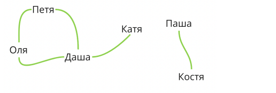

### "Графы"

Социальную сеть можно представить себе в виде графа, где вершинами будут аккаунты пользователей, а наличие 
ребра будет показывать наличие между двумя пользователями дружбы (что они друг друга добавили в друзья).

Например, рассмотрим такой граф:

**Алгоритм**
Для того чтобы определить, можно ли дойти из анкеты a до анкеты b, запустим обход в глубину из вершины a. Если 
мы в его процессе наткнёмся на b, то дойти можно; иначе - нет.